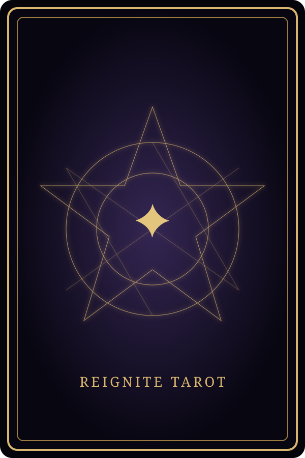

<!doctype html>
<html lang="ja">
<head>
  <meta charset="utf-8" />
  <meta name="viewport" content="width=device-width, initial-scale=1" />
  <meta name="theme-color" content="#080713" />
  <meta name="description" content="スキ3000突破記念・人生再点火タロット。無料で楽しめる大アルカナ22枚のオリジナル占いです。" />
  <title>人生再点火タロット</title>
  <link rel="preconnect" href="https://fonts.googleapis.com">
  <link rel="preconnect" href="https://fonts.gstatic.com" crossorigin>
  <link href="https://fonts.googleapis.com/css2?family=Shippori+Mincho:wght@400;600;700&family=Cormorant+Garamond:wght@500;600;700&display=swap" rel="stylesheet">
  <link rel="stylesheet" href="style.css?v=5.1" />
</head>
<body>
  <canvas id="stars" aria-hidden="true"></canvas>
  

  

    

    

    

  

  <main class="app-shell">
    <section id="home" class="screen active hero" aria-labelledby="main-title">
      
✦

      
スキ3000突破記念・読者無料サービス

      <h1 id="main-title">人生再点火 TAROT</h1>
      
今、心に浮かぶことを一つだけ。 二十二枚のカードが、まだ言葉にならない兆しを映します。

      <button class="primary" data-go="modes">カードをひらく</button>
      
この占いは娯楽を目的としたものです。重要な判断は、現実の情報も大切にしてください。

    </section>

    <section id="modes" class="screen" aria-labelledby="mode-title">
      <button class="back" data-go="home" aria-label="戻る">←</button>
      
CHOOSE A READING

      <h2 id="mode-title">何を占いますか</h2>
      

        <button class="mode-card" data-mode="one"><b>今日の一枚</b>今日の流れと小さな指針</button>
        <button class="mode-card" data-mode="answer"><b>迷いへの答え</b>いま抱える問いへの示唆</button>
        <button class="mode-card" data-mode="three"><b>過去・現在・未来</b>三枚で物語の流れを見る</button>
        <button class="mode-card" data-mode="reignite"><b>人生再点火の兆し</b>次の一歩に必要な火種</button>
      

    </section>

    <section id="question" class="screen" aria-labelledby="question-title">
      <button class="back" data-go="modes" aria-label="戻る">←</button>
      
YOUR QUESTION

      <h2 id="question-title">心の中で問いを整えてください</h2>
      
言葉にしても、胸にしまったままでもかまいません。

      <textarea id="question-input" maxlength="120" placeholder="例：これから始めたいことについて、何を大切にすればよい？"></textarea>
      
0/120

      <button class="primary" id="begin-reading">カードを並べる</button>
    </section>

    <section id="daily-warning" class="screen omen-screen" aria-labelledby="daily-warning-title">
      
A SECOND QUESTION

      
☾

      <h2 id="daily-warning-title">今日は、すでに一度カードに問いかけています</h2>
      
同じ日に何度も答えを求めると、最初に受け取った兆しを見失うことがあります。

      
それでも、もう一度だけ問いかけますか？

      

        <button class="primary danger-soft" id="warning-continue">それでも占う</button>
        <button class="secondary" id="warning-stop">今日はやめる</button>
      

    </section>

    <section id="daily-silence" class="screen omen-screen silence-screen" aria-labelledby="daily-silence-title">
      
THE CARDS REMAIN SILENT

      

      <h2 id="daily-silence-title">カードは、今日はもう答えません</h2>
      
これ以上、同じ日に答えを求めてはいけません。

      
今日のカードは沈黙を選びました。最初に受け取った言葉を、しばらくそのまま置いてみてください。

      <button class="secondary" data-go="home">入口へ戻る</button>
    </section>

    <section id="daily-closed" class="screen omen-screen closed-screen" aria-labelledby="daily-closed-title">
      
THE GATE IS CLOSED

      
✦

      <h2 id="daily-closed-title">今日はもう、カードは答えません</h2>
      
また日付が変わってから、静かな気持ちで訪れてください。

      <button class="secondary" data-go="home">入口へ戻る</button>
    </section>

    <section id="draw" class="screen" aria-labelledby="draw-title">
      
LISTEN TO YOUR INTUITION

      <h2 id="draw-title">惹かれるカードを選んでください</h2>
      
一枚選びます

      

      

    </section>

    <section id="reveal" class="screen" aria-labelledby="reveal-title">
      
THE CARDS HAVE SPOKEN

      <h2 id="reveal-title">カードを受け取って</h2>
      

      <button class="primary" id="show-result">言葉を受け取る</button>
    </section>

    <section id="result" class="screen result-screen" aria-labelledby="result-title">
      
YOUR READING

      <h2 id="result-title">今回のメッセージ</h2>
      

      

      

        <button class="primary" id="save-result">結果を画像保存</button>
        <button class="secondary" id="again">もう一度占う</button>
      

      
結果画像には、入力した質問文は表示されません。

    </section>
  </main>

  <footer>© 人生再点火タロット Effects v5.4.0</footer>
  
  
</body>
</html>

## v5.4.0
1枚引きの「カードを受け取って」画面に専用クリック/タップ領域を追加。

## v5.4.0
- 1枚引きの受け取り演出を3枚引きと同じ処理に統一。
- reveal画面で裏面から自動回転して表面を表示。
- 画面フッターのバージョンを Effects v5.4.0 に更新。

## v5.4.0 audit
- 1枚引きの状態遷移を再構成: 選択 → 裏面回転 → 自動受取待ち → カードクリック → 開示 → 結果。
- 過去の1枚引きクリック対策CSSを削除し、単一の button 要素に統一。
- style.css のキャッシュバスターが v5.1 のままだった不整合を v5.4.0 に修正。
- app.js / cards.js / style.css のバージョンを v5.4.0 に統一。
